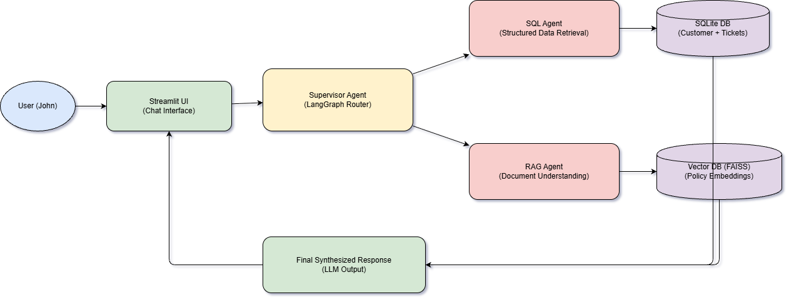

# GenAI Multi-Agent Customer Support Assistant

A Generative AI-powered multi-agent system that enables natural language interaction with both **structured customer data** and **unstructured policy documents**.

This project was built as part of a GenAI assessment to demonstrate how specialized agents can collaborate to answer customer support queries more efficiently and accurately.

## Overview

Customer support executives often need to retrieve information from multiple sources such as customer databases, support ticket systems, and policy documents. This project solves that problem by providing a unified conversational interface where users can:

- query customer and support ticket data using natural language
- upload and search policy PDF documents
- receive grounded, context-aware responses
- handle both structured and unstructured data through a multi-agent workflow

The system uses a **LangGraph-based multi-agent architecture** with specialized agents for:

- **SQL Agent** for structured customer and ticket data
- **RAG Agent** for policy document understanding
- **Supervisor Agent** for routing and orchestration
- **Synthesis step** for combining outputs into a final response

---

## Architecture



### High-level flow

1. The user submits a question through the Streamlit UI.
2. A supervisor agent classifies the query as:
   - structured data query
   - policy/document query
   - hybrid query requiring both
3. The request is routed to the appropriate specialized agent:
   - **SQL Agent** queries the SQLite customer/ticket database
   - **RAG Agent** retrieves relevant policy chunks from the vector database
4. The outputs are combined into a final user-friendly response.

---

## System Components

### 1. Streamlit UI
Provides a simple chat-style interface for:
- asking natural language questions
- uploading policy PDFs
- testing structured, unstructured, and hybrid queries

### 2. Supervisor Agent
Built using **LangGraph** to determine whether a query should be answered by:
- SQL Agent
- RAG Agent
- both agents

### 3. SQL Agent
Handles natural language queries related to:
- customer profile details
- account status
- support ticket history
- support issue summaries

Structured data is stored in **SQLite**.

### 4. RAG Agent
Processes uploaded policy documents by:
- loading PDFs
- chunking text
- generating embeddings
- storing vectors in **FAISS**
- retrieving relevant chunks for grounded question answering

### 5. MCP-style Tool Server
A lightweight **FastAPI-based tool server** is included to expose structured tools for:
- customer lookup
- ticket lookup
- policy search

This simulates an MCP-style tool access layer for agent interaction.

---

## Tech Stack

- **Python**
- **LangChain**
- **LangGraph**
- **Streamlit**
- **FastAPI**
- **SQLite**
- **FAISS**
- **OpenAI API** (for LLM + embeddings)
- **PyMuPDF / pypdf** for PDF parsing

---

## Project Structure

```text
genai-multi-agent-support/
│
├── app/
│   ├── ui.py
│   ├── graph.py
│   ├── agents/
│   │   ├── supervisor_agent.py
│   │   ├── sql_agent.py
│   │   └── rag_agent.py
│   ├── tools/
│   │   ├── sql_tools.py
│   │   ├── rag_tools.py
│   │   └── mcp_tools.py
│   ├── ingestion/
│   │   ├── pdf_ingest.py
│   │   └── embeddings.py
│   ├── db/
│   │   ├── schema.sql
│   │   ├── seed_data.py
│   │   └── support.db
│   └── utils/
│       ├── config.py
│       └── prompts.py
│
├── data/
│   ├── policies/
│   └── vector_store/
│
├── assets/
│   └── architecture.png
│
├── README.md
├── requirements.txt
└── .env.example